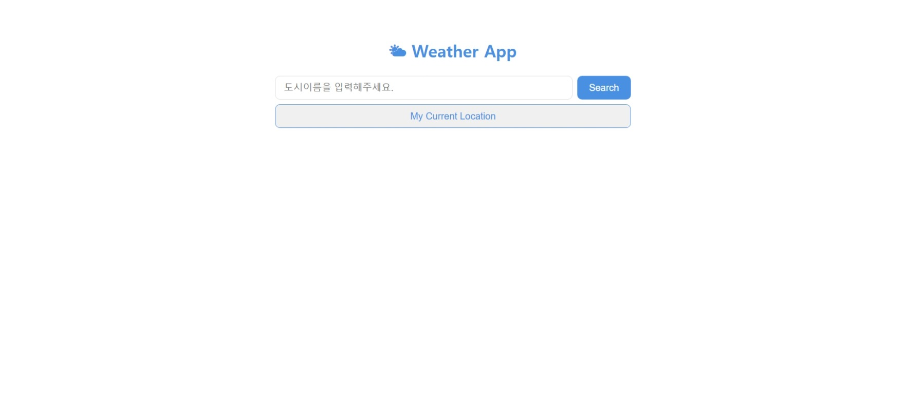
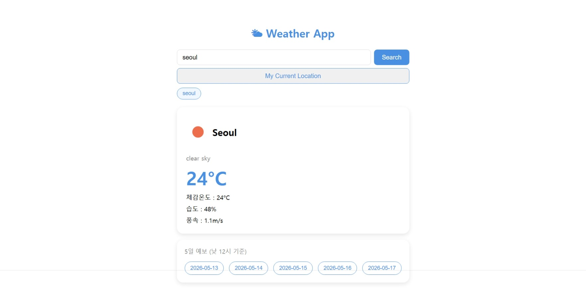
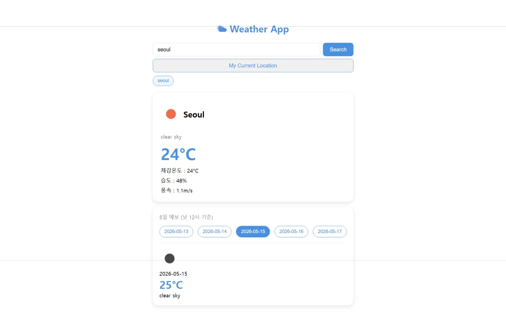

# 🌤 WeatherNow

> OpenWeatherMap API 기반 현재 날씨 및 5일 예보 조회 앱

   

---

## 📎 배포 링크

🔗 [WeatherNow 바로가기](https://weather-now-nine-iota.vercel.app/)

---

## 📸 화면 구성

|                        홈                        |                   날씨 검색 결과                   |                    5일 예보 상세                     |
| :----------------------------------------------: | :------------------------------------------------: | :--------------------------------------------------: |
|  |  |  |

---

## 📌 주요 기능

- 한글 / 영어 도시명 모두 검색 지원 (Google Geocoding API 연동)
- 도시 이름으로 현재 날씨 검색 (엔터 / 버튼 모두 지원)
- 현재 위치 기반 날씨 자동 조회 (Geolocation API)
- 날씨 아이콘, 온도, 체감온도, 습도, 풍속 표시
- 5일 예보 (낮 12시 기준 대표값) — 날짜 클릭 시 상세 정보 확인
- 최근 검색 도시 목록 저장 (localStorage, 최대 5개)
- 검색 성공 시에만 최근 목록에 추가 (실패 시 저장 안 됨)
- API 실패 / 도시 없음 / 위치 권한 거부 에러 메시지 처리

---

## 🛠 기술 스택

| 역할   | 기술                    |
| ------ | ----------------------- |
| UI     | React 18                |
| 언어   | TypeScript              |
| 스타일 | CSS Modules             |
| 빌드   | Vite                    |
| API    | OpenWeatherMap REST API |
| 번역   | Google Geocoding API    |

---

## 📁 프로젝트 구조

```
src/
├── components/
│   ├── SearchBar.tsx         # 검색 입력 + 버튼
│   ├── SearchBar.module.css
│   ├── RecentCities.tsx      # 최근 검색 도시 버튼
│   ├── RecentCities.module.css
│   ├── WeatherCard.tsx       # 현재 날씨 카드
│   ├── WeatherCard.module.css
│   ├── ForecastSection.tsx   # 5일 예보 날짜 버튼 + 상세
│   └── ForecastSection.module.css
├── hooks/
│   └── useWeather.ts         # 날씨 API 호출 및 상태 관리 로직
├── types.ts                  # 공통 타입 정의
└── App.tsx                   # 루트 컴포넌트
```

---

## 🔧 구현 포인트

### 한글 도시명 검색 지원 (Google Geocoding API)

OpenWeatherMap API는 영어 도시명 기반으로 동작합니다. 한글 검색을 지원하기 위해 Google Geocoding API를 중간 매개체로 활용했습니다. 사용자가 한글로 도시명을 입력하면 `translateCity` 함수가 영어로 변환 후 날씨 API를 호출합니다. 인풋창은 사용자가 입력한 값 그대로 유지됩니다.

```ts
const translateCity = async (city: string): Promise<string> => {
  const res = await fetch(
    `https://maps.googleapis.com/maps/api/geocode/json?address=${encodeURIComponent(city)}&language=en&key=${GOOGLE_API_KEY}`,
  );
  const data = await res.json();
  if (data.results && data.results.length > 0) {
    const addressComponents = data.results[0].address_components;
    const cityComponent = addressComponents.find(
      (c) =>
        c.types.includes("locality") ||
        c.types.includes("administrative_area_level_1"),
    );
    return cityComponent ? cityComponent.long_name : city;
  }
  return city;
};
```

---

### useReducer로 복잡한 상태 관리

`loading`, `error`, `weather`, `city`, `recentCities`, `forecast` 6개의 상태가 서로 연관되어 있어 `useState` 대신 `useReducer`를 선택했습니다. `SEARCH_START`, `SEARCH_SUCCESS`, `SEARCH_FAIL` 액션 단위로 상태 전환을 명확하게 표현해 예측 가능한 상태 관리를 구현했습니다.

```ts
type Action =
  | { type: "INPUT_CHANGE"; payload: string }
  | { type: "SEARCH_START"; payload: string }
  | {
      type: "SEARCH_SUCCESS";
      payload: { weather: Weather; forecast: Forecast[] };
    }
  | { type: "SEARCH_FAIL"; payload: string };
```

---

### 커스텀 훅으로 로직과 UI 분리

API 호출, 상태 관리, localStorage 처리 등의 로직을 `useWeather` 커스텀 훅으로 분리했습니다. `App.tsx`는 렌더링에만 집중하고, `dispatch`를 외부에 노출하지 않고 핸들러 함수 형태로만 제공합니다.

```ts
const handleInputChange = (value: string) =>
  dispatch({ type: "INPUT_CHANGE", payload: value });

return {
  state,
  selectedDate,
  setSelectedDate,
  getWeather,
  getCurrentLocation,
  handleInputChange,
};
```

---

### Promise.all로 API 병렬 호출

현재 날씨와 5일 예보 API를 `Promise.all`로 동시에 호출해 로딩 시간을 단축했습니다.

```ts
const [weatherRes, forecastRes] = await Promise.all([
  fetch(`...weather?q=${targetCity}...`),
  fetch(`...forecast?q=${targetCity}...`),
]);
```

---

### 5일 예보 데이터 가공

OpenWeatherMap forecast API는 3시간 간격으로 40개 데이터를 반환합니다. `dt_txt`에서 `"12:00:00"`을 포함하는 데이터만 필터링해 낮 12시 기준 대표값 5개만 추출했습니다.

```ts
forecastJson.list
  .filter((item: ForecastItem) => item.dt_txt.includes("12:00:00"))
  .map((item: ForecastItem) => ({
    date: item.dt_txt.slice(0, 10),
    temp: item.main.temp,
    icon: item.weather[0].icon,
    description: item.weather[0].description,
  }));
```

---

### 최근 검색 도시 관리

검색 성공 시에만 최근 목록에 추가하고, 중복 제거 및 최대 5개 제한을 적용했습니다.
localStorage 저장과 React 상태 업데이트를 `SEARCH_SUCCESS` 리듀서 케이스 안에서
함께 처리해 두 값이 항상 동기화되도록 했습니다.

```ts
case "SEARCH_SUCCESS": {
  const newRecentCities = state.city
    ? [state.city, ...state.recentCities.filter((city) => city !== state.city)].slice(0, 5)
    : state.recentCities;
  localStorage.setItem("recentCities", JSON.stringify(newRecentCities));
  return { ...state, recentCities: newRecentCities, ... };
}
```

---

### 응답 파싱 로직 분리 (parseWeatherPayload)

`getWeather`(도시명 검색)와 `getCurrentLocation`(위치 기반 검색) 두 함수 모두
동일한 API 응답 구조를 받아 같은 형태의 payload로 가공해야 합니다.
이 파싱 로직을 `parseWeatherPayload` 함수로 분리해 중복을 제거하고,
API 응답 타입(`WeatherApiResponse`, `ForecastApiResponse`)을 별도로 정의해
`any` 없이 타입 안전하게 처리했습니다.

---

## 🚀 시작하기

```bash
# 패키지 설치
npm install

# 개발 서버 실행
npm run dev
```

루트에 `.env` 파일 생성 후 아래 내용 추가

```
VITE_API_KEY=your_openweathermap_api_key
VITE_GOOGLE_API_KEY=your_google_api_key
```

> OpenWeatherMap API 키는 [https://openweathermap.org](https://openweathermap.org) 에서 발급받을 수 있습니다.

> Google API 키는 [https://console.cloud.google.com](https://console.cloud.google.com) 에서 발급받을 수 있습니다. (Geocoding API 활성화 필요)
